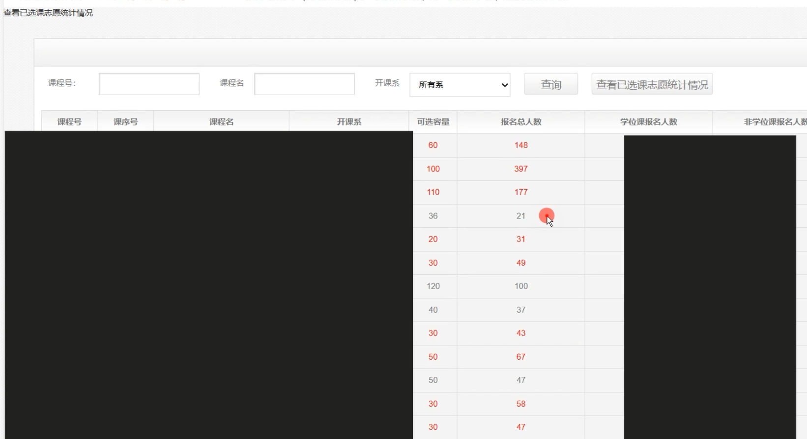

# Enhanced-Course-Selection-Assistant-for-Tsinghua-University-
自己选课时遇到了不方便的地方，所以在清华大学选课系统（Web网页）的基础上，增加了一些逻辑，（基于网页的油猴插件）实现了判断待选课程是否和已选课程冲突、所选的所有课程中哪些课程已爆满等功能，逐步完善吧！
总的视频:

- 一个是自动高亮已选课程里和鼠标指向的课冲突的课

- 另一个是查看志愿人数时自动高亮报名人数超过容量的课

## TODO List:
- [x] 自动高亮课程冲突
- [x] 自动高亮爆满课程
- [ ] 获取新需求
- [ ] 与大🔥交流
